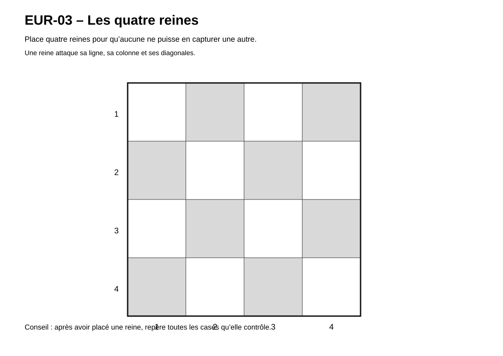

# Énigmes Eurekamaths

> Des énigmes progressives pour chercher, tester, raisonner et expliquer une démarche.

## Activités disponibles

### EUR-01 — Triangle magique

[Consulter l’énigme du triangle magique](EUR-01-Triangle-magique.md)

### EUR-02 — Carré magique incomplet

[Consulter l’énigme du carré magique incomplet](EUR-02-Carre-magique-incomplet.md)

### EUR-03 — Les quatre reines

- [Consulter la fiche de l’activité](EUR-03-Les-quatre-reines.md)
- [Ouvrir le support en plein écran](EUR-03-Les-quatre-reines.svg)

## Aperçu du support « Les quatre reines »

[{ width="100%" }](EUR-03-Les-quatre-reines.svg)