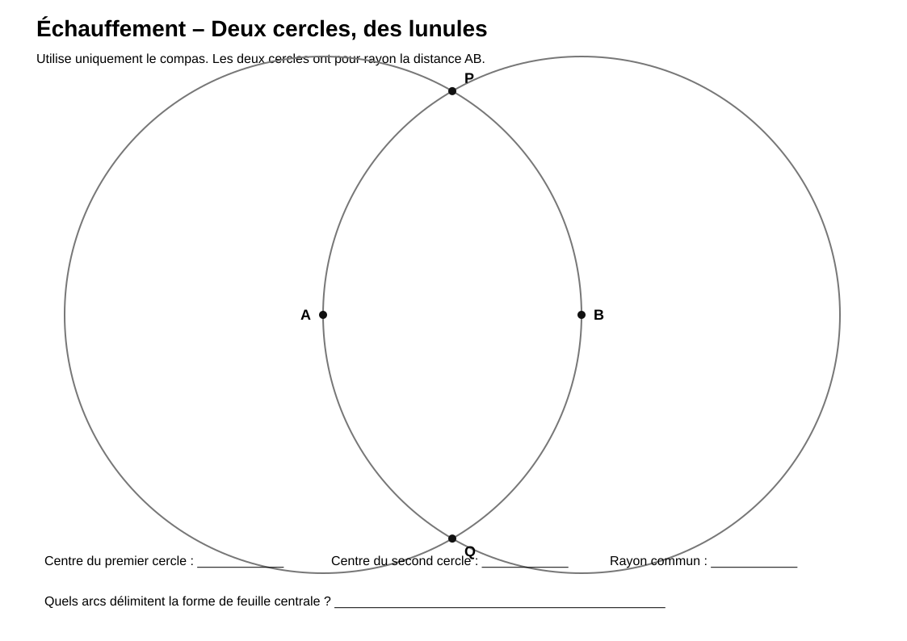
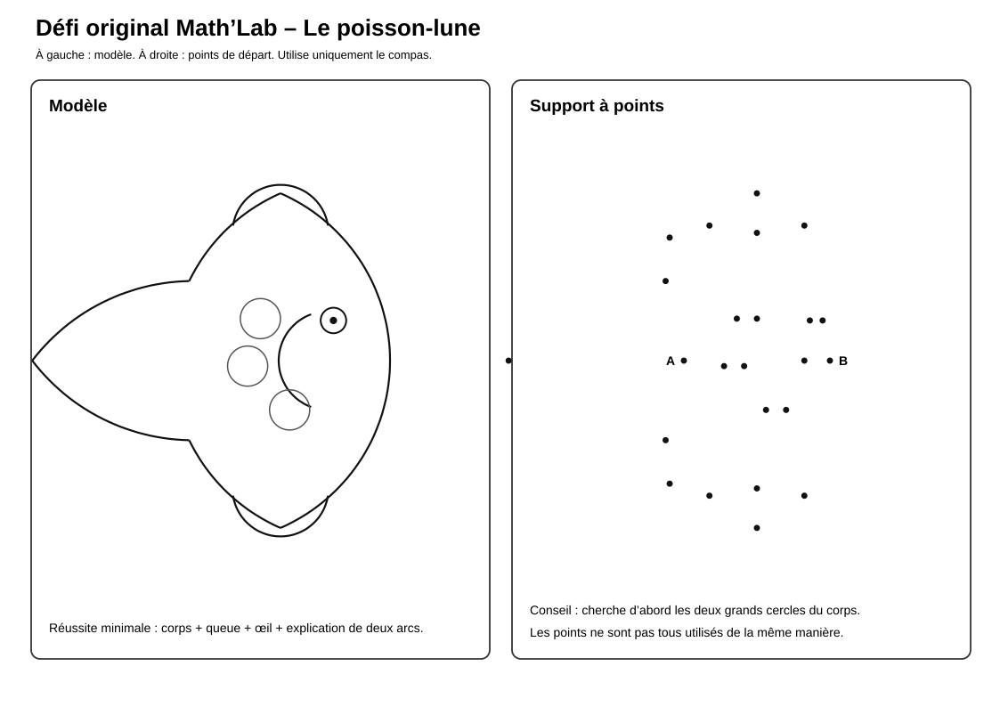

# Red Fish — Les lunules

> Une activité de recherche géométrique autour des lunules, de l’observation et de la formulation de conjectures.

## Documents de l’activité

### Pour les élèves

- [Fiche mission](Red-fish-Fiche-mission.md)
- [Échauffement](Lunules-Echauffement.svg)
- [Défi original du poisson-lune](Poisson-lune-Defi-original.svg)
- [Document PDF complet](lunules%20red%20fish.pdf)

### Pour l’enseignant

- [Repères enseignant](Red-fish-Reperes-enseignant.md)
- [Accès au site officiel](Red-fish-Acces-officiel.md)

---

## Aperçu de l’échauffement

[{ width="100%" }](Lunules-Echauffement.svg)

---

## Aperçu du défi original

[{ width="100%" }](Poisson-lune-Defi-original.svg)

---

## Aperçu du document PDF

<object
  data="lunules%20red%20fish.pdf"
  type="application/pdf"
  width="100%"
  height="800">
  

    Le PDF ne peut pas être affiché directement.
    <a href="lunules%20red%20fish.pdf">Ouvrir le document PDF</a>.
  

</object>