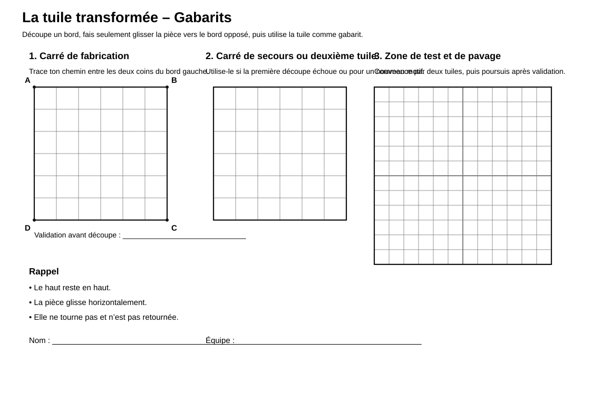
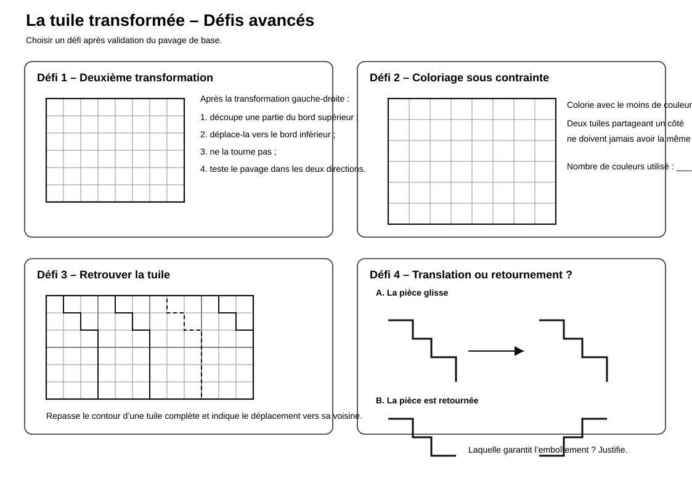

# Pavage — Tuile transformée

> Une activité de géométrie autour de la transformation d’une tuile et de la création d’un pavage.

## Documents de l’activité

### Pour les élèves

- [Fiche élève](Pavage-tuile-transformee-Fiche-eleve.md)
- [Gabarits à utiliser](Pavage-tuile-transformee-Gabarits.svg)
- [Défis avancés](Pavage-tuile-transformee-Defis-avances.svg)

### Pour l’enseignant

- [Repères enseignant](Pavage-tuile-transformee-Reperes-enseignant.md)

---

## Aperçu des gabarits

[{ width="100%" }](Pavage-tuile-transformee-Gabarits.svg)

---

## Aperçu des défis avancés

[{ width="100%" }](Pavage-tuile-transformee-Defis-avances.svg)