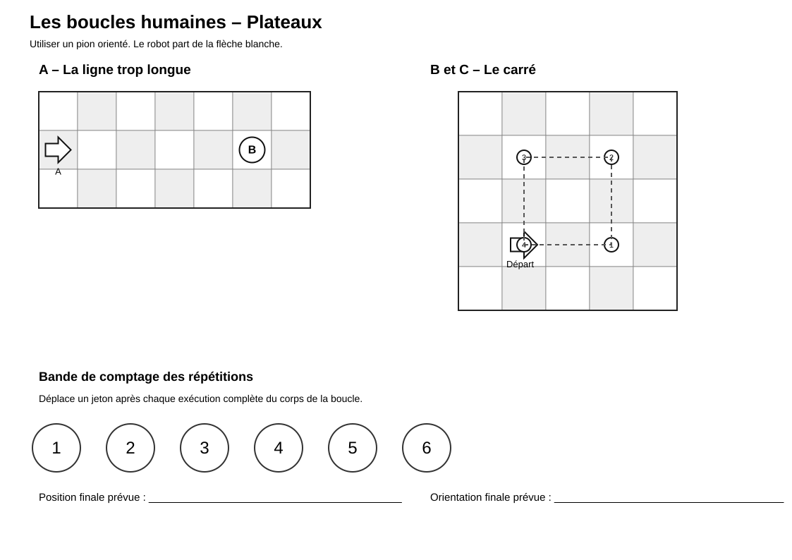
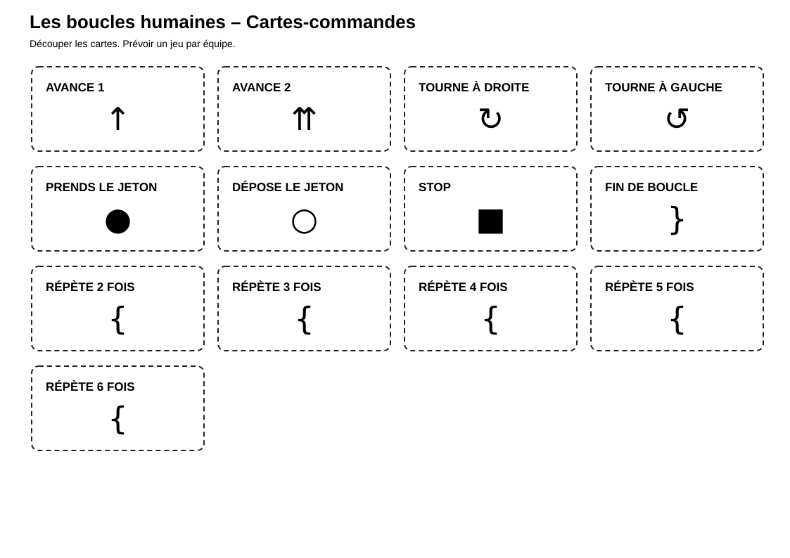

# Boucles humaines

> Une activité d’algorithmique débranchée pour comprendre les instructions, les déplacements et les boucles.

## Documents de l’activité

### Pour les élèves

- [Fiche élève](Boucles-humaines-Fiche-eleve.md)
- [Cartes de commandes](Boucles-humaines-Cartes-commandes.svg)
- [Plateaux de jeu](Boucles-humaines-plateaux.svg)
- [Défis avancés](Boucles-humaines-Defis-avances.md)

### Pour l’enseignant

- [Repères enseignant](Boucles-humaines-Reperes-enseignant.md)

---

## Aperçu des plateaux

[{ width="100%" }](Boucles-humaines-plateaux.svg)

---

## Aperçu des cartes de commandes

[{ width="100%" }](Boucles-humaines-Cartes-commandes.svg)