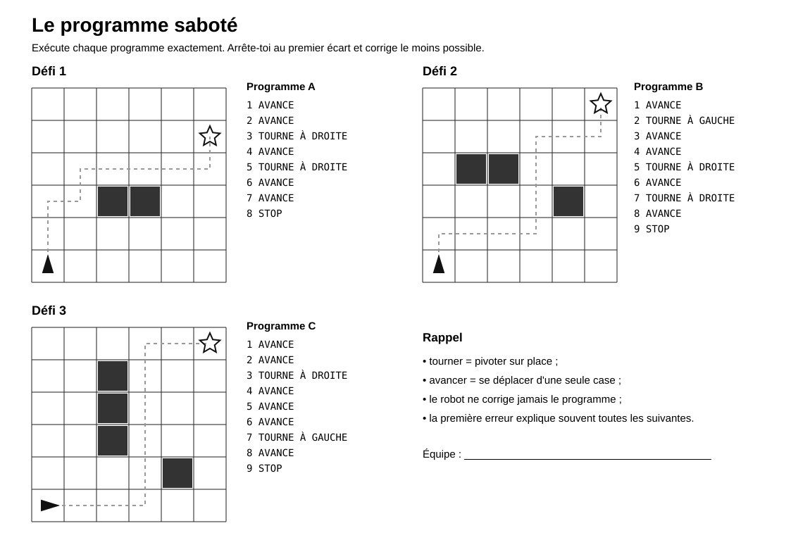
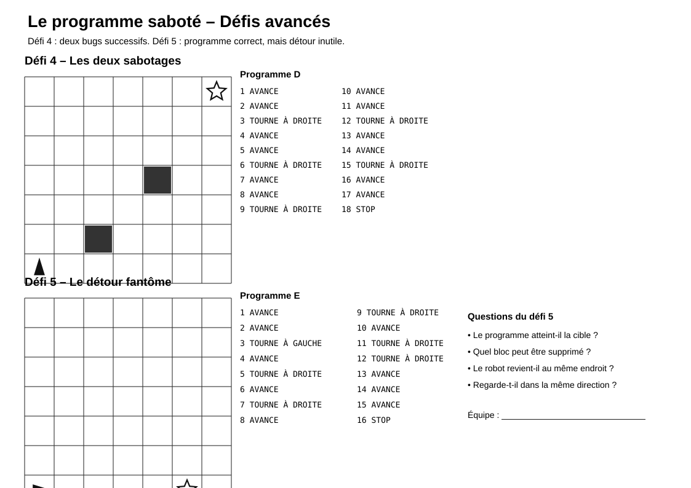

# Le programme saboté

> Une activité d’algorithmique débranchée dans laquelle les élèves doivent repérer, expliquer et corriger des erreurs dans un programme.

## Documents de l’activité

### Pour les élèves

- [Fiche élève complète](Programme-sabote-Fiche-eleve-complete.md)
- [Plateaux](Programme-sabote-Plateaux.svg)
- [Défis avancés](Programme-sabote-Defis-avances.svg)

### Pour l’enseignant

- [Repères enseignant](Programme-sabote-Reperes-enseignant-complet.md)

---

## Aperçu des plateaux

[{ width="100%" }](Programme-sabote-Plateaux.svg)

---

## Aperçu des défis avancés

[{ width="100%" }](Programme-sabote-Defis-avances.svg)