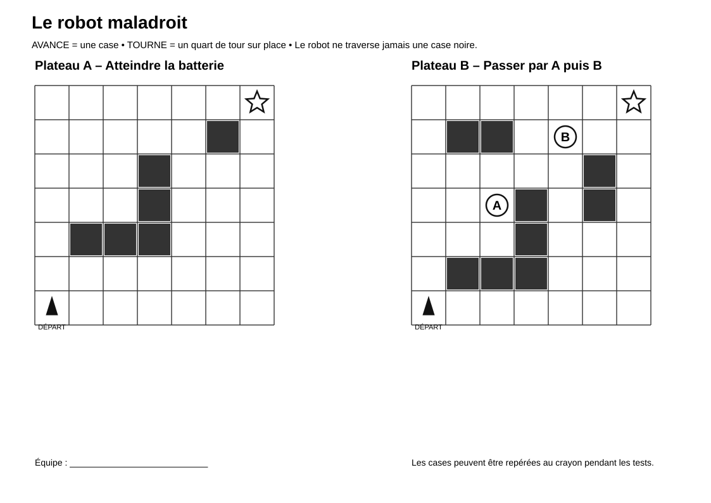

# Le robot maladroit

> Une activité d’algorithmique débranchée dans laquelle les élèves doivent comprendre, exécuter et corriger un programme de déplacement.

## Documents de l’activité

### Pour les élèves

- [Fiche élève](Robot-maladroit-Fiche-eleve.md)
- [Plateaux de jeu](Robot-maladroit-Plateaux.svg)

### Pour l’enseignant

- [Repères enseignant](Robot-maladroit-Reperes-enseignant.md)

---

## Aperçu des plateaux

[{ width="100%" }](Robot-maladroit-Plateaux.svg)