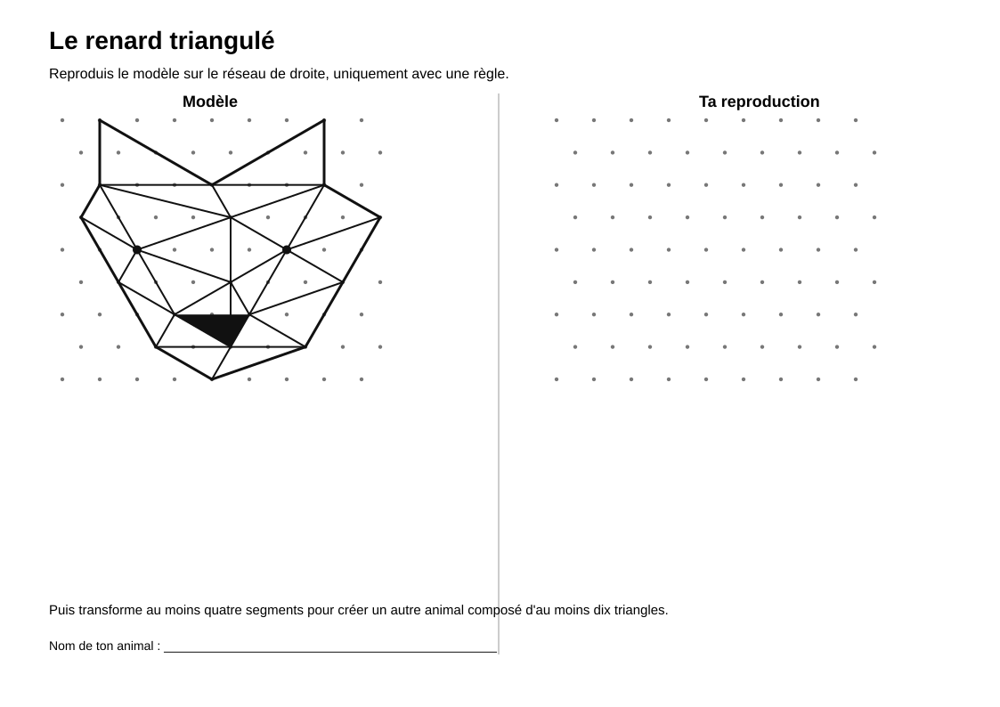

# Renard triangulé

> Une activité de construction géométrique dans laquelle les élèves réalisent un animal à partir de segments et de triangles.

## Documents de l’activité

### Pour les élèves

- [Fiche élève](Renard-triangule-Fiche-eleve.md)
- [Support élève](Renard-triangule-Support-eleve.svg)

### Pour l’enseignant

- [Repères enseignant](Renard-triangule-Reperes-enseignant.md)

---

## Aperçu du support élève

[{ width="100%" }](Renard-triangule-Support-eleve.svg)