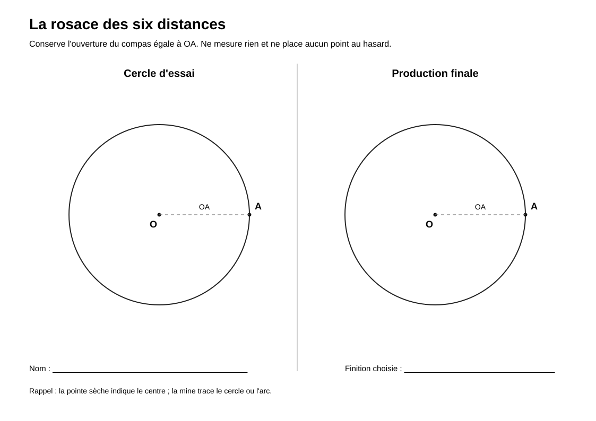

# Rosace à six distances

> Une activité de construction géométrique autour du cercle, du compas et de la reproduction de distances.

## Documents de l’activité

### Pour les élèves

- [Fiche élève](Rosace-six-distances-Fiche-eleve.md)
- [Support élève](Rosace-six-distances-Support-eleve.svg)

### Pour l’enseignant

- [Repères enseignant](Rosace-six-distances-Reperes-enseignant.md)

---

## Aperçu du support élève

[{ width="100%" }](Rosace-six-distances-Support-eleve.svg)