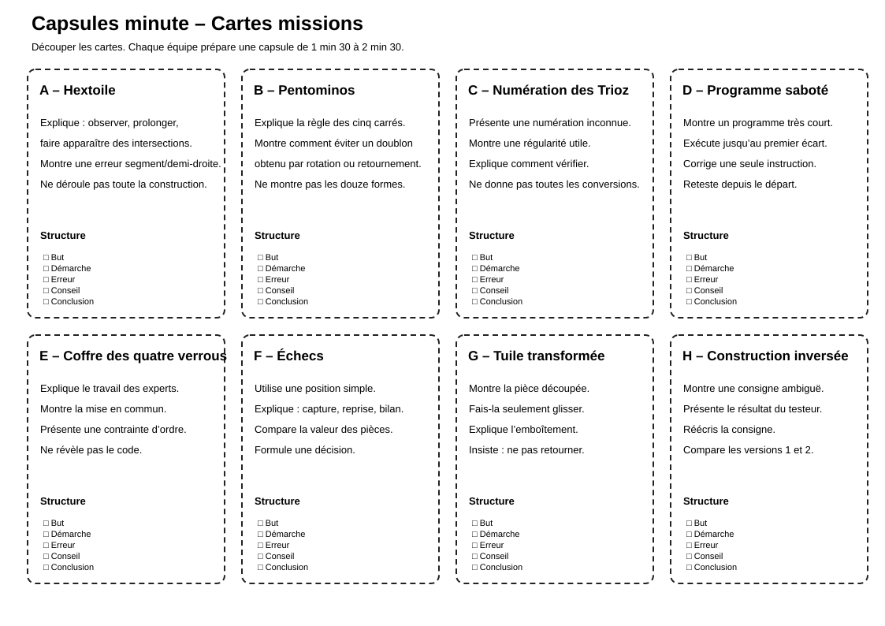
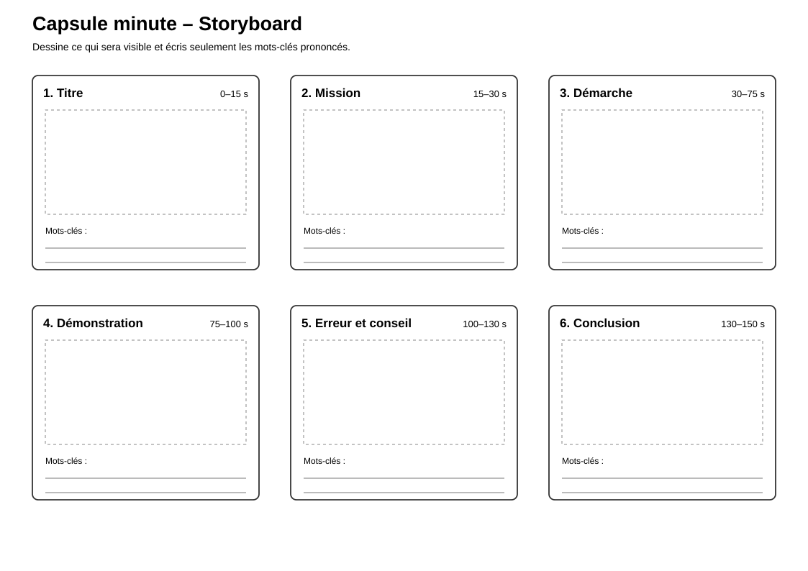

# Capsules-minute

> Une activité de communication mathématique dans laquelle les élèves préparent et réalisent une courte capsule pour expliquer clairement une idée, une démarche ou une construction.

## Documents de l’activité

### Pour les élèves

- [Cartes de missions](Capsules-minute-Cartes-missions.svg)
- [Fiche de préparation du script](Capsules-minute-Fiche-script.md)
- [Plan de tournage](Capsules-minute-Plan-tournage.md)
- [Storyboard](Capsules-minute-Storyboard.svg)
- [Grille de visionnage](Capsules-minute-Grille-visionnage.md)

### Pour l’enseignant

- [Repères enseignant](Capsules-minute-Reperes-enseignant.md)

---

## Aperçu des cartes de missions

[{ width="100%" }](Capsules-minute-Cartes-missions.svg)

---

## Aperçu du storyboard

[{ width="100%" }](Capsules-minute-Storyboard.svg)