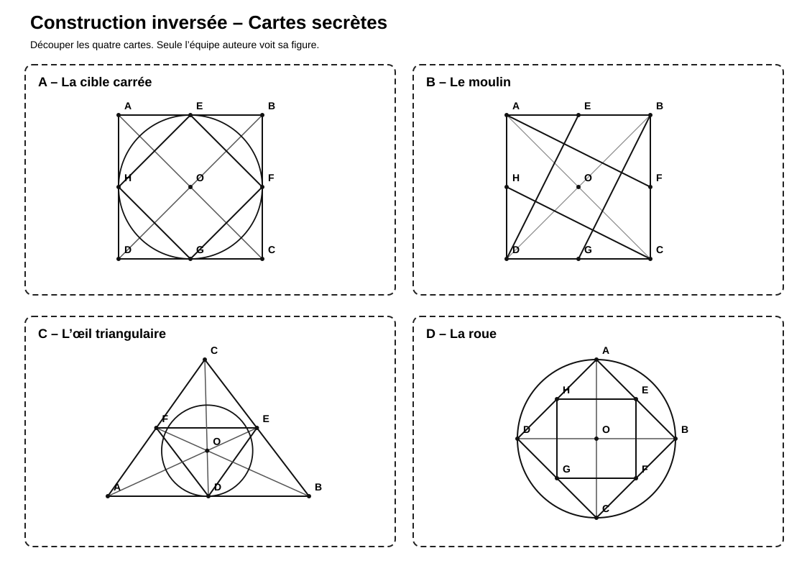
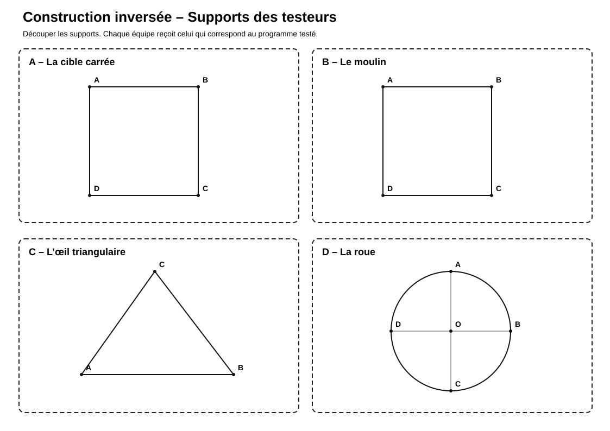
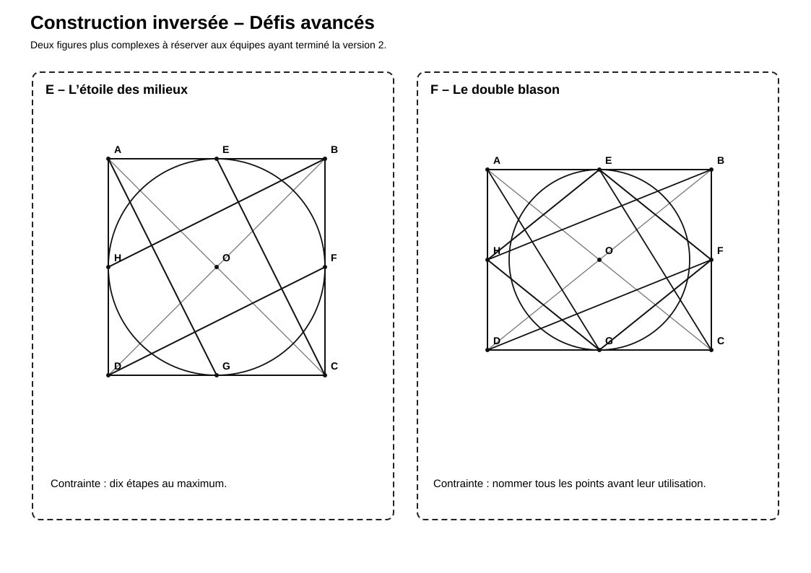

# Construction inversée

> Une activité de communication géométrique dans laquelle une équipe rédige un programme de construction et une autre tente de reproduire la figure sans la voir.

## Documents de l’activité

### Pour les élèves

- [Fiche des auteurs](Construction-inversee-Fiche-auteurs.md)
- [Fiche des testeurs](Construction-inversee-Fiche-testeurs.md)
- [Supports des récepteurs](Construction-inversee-Supports-recepteurs.svg)
- [Cartes secrètes](Construction-inversee-Cartes-secretes.svg)
- [Défis avancés](Construction-inversee-Defis-avances.svg)

### Pour l’enseignant

- [Repères enseignant](Construction-inversee-Reperes-enseignant.md)

---

## Aperçu des cartes secrètes

[{ width="100%" }](Construction-inversee-Cartes-secretes.svg)

---

## Aperçu des supports des récepteurs

[{ width="100%" }](Construction-inversee-Supports-recepteurs.svg)

---

## Aperçu des défis avancés

[{ width="100%" }](Construction-inversee-Defis-avances.svg)