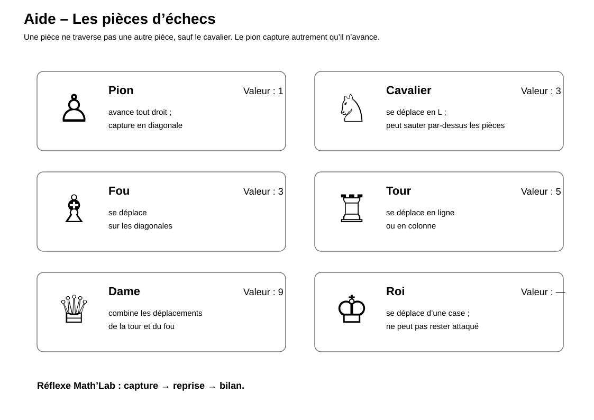
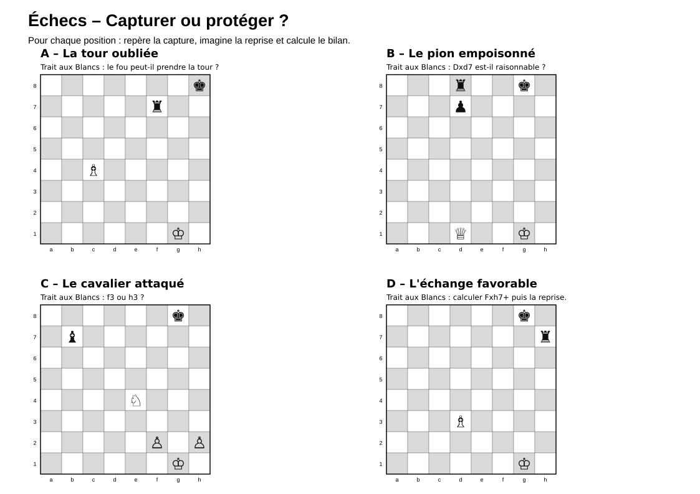
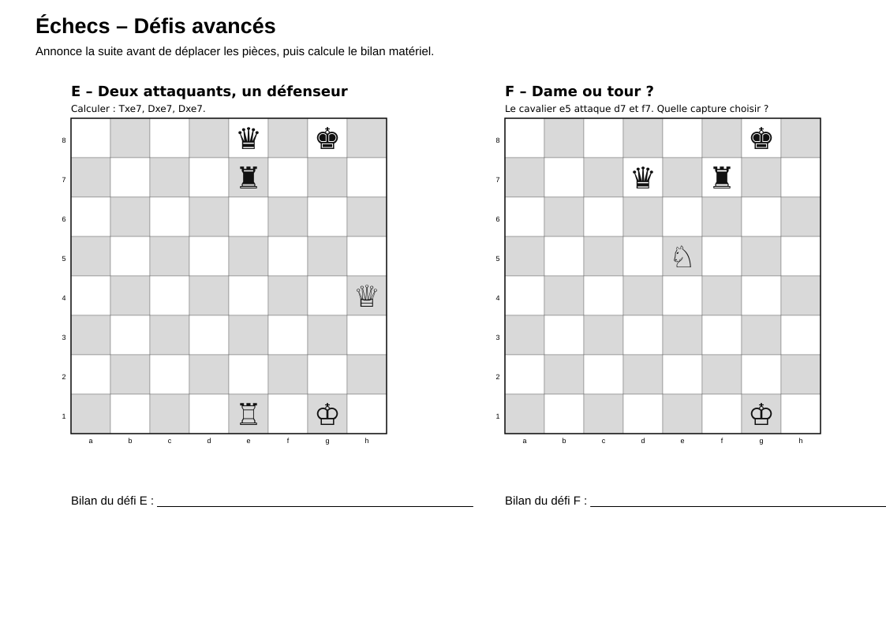

# Échecs — Capturer ou protéger

> Une activité de recherche autour des déplacements des pièces, des menaces et de la protection aux échecs.

## Documents de l’activité

### Pour les élèves

- [Fiche élève](Echecs-Capturer-ou-proteger-Fiche-eleve.md)
- [Aide sur les pièces](Echecs-Aide-pieces.svg)
- [Positions de base](Echecs-Capturer-ou-proteger-Positions-base.svg)
- [Défis avancés](Echecs-Capturer-ou-proteger-Defis-avances.svg)

### Pour l’enseignant

- [Repères enseignant](Echecs-Capturer-ou-proteger-Reperes-enseignant.md)

---

## Aperçu de l’aide sur les pièces

[{ width="100%" }](Echecs-Aide-pieces.svg)

---

## Aperçu des positions de base

[{ width="100%" }](Echecs-Capturer-ou-proteger-Positions-base.svg)

---

## Aperçu des défis avancés

[{ width="100%" }](Echecs-Capturer-ou-proteger-Defis-avances.svg)